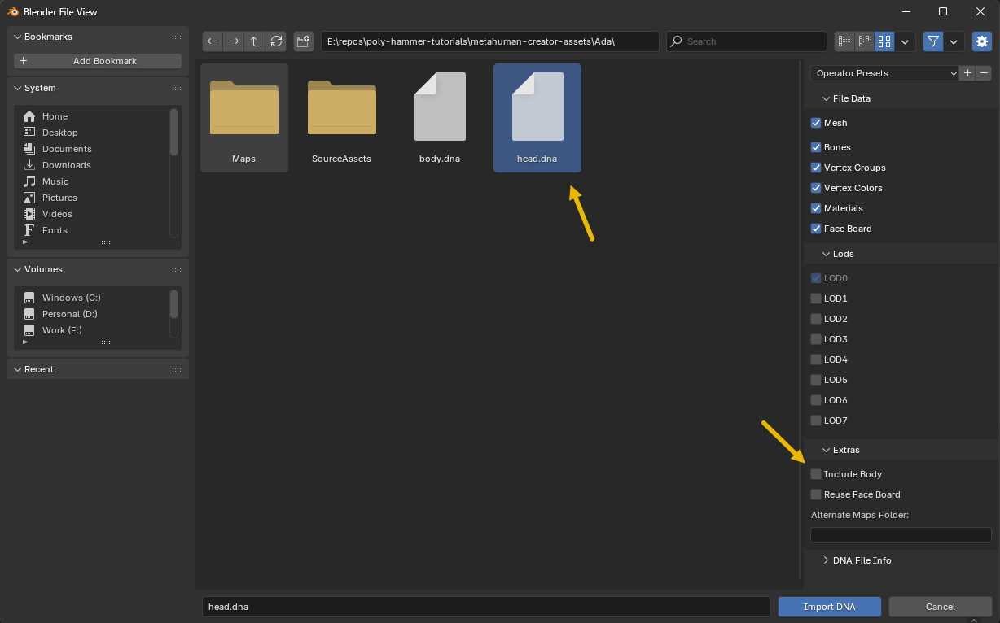
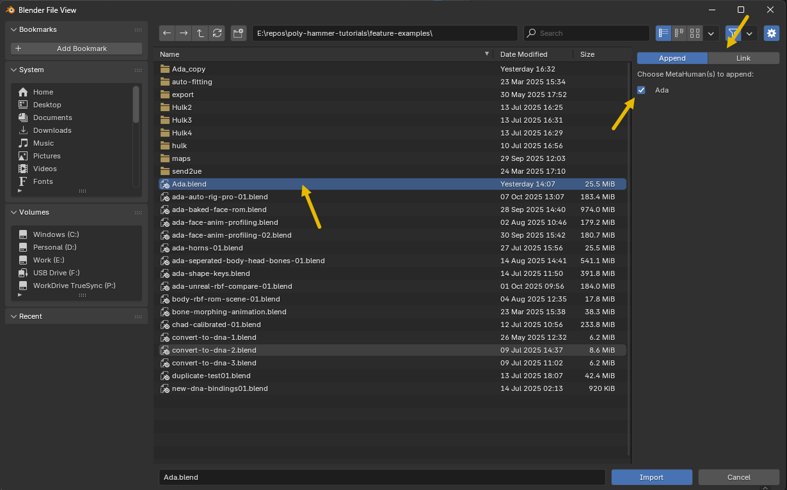

# Import

## DNA Files

There are several ways to import your `.dna` files. You can drag and drop them in the viewport, or you can open the import dialog with `File > Import > MetaHuman DNA (.dna)`.

Once you select a `head.dna` file it will look for the corresponding `body.dna` in that directory, giving you the option to check the `Include Body` box to include it your import process.

!!! note
    When head and body are imported together, the import process will setup the constraints to that the MetaHuman head follows the body bones.

## Blend Files

There is also another option to `Append` or `Link` a MetaHuman from another `.blend` file. This could be useful on a production where you are composing a scene with MetaHuman character that you already setup in another file.

When you select a `.blend` file you will see a list of available MetaHumans in that `.blend` file that are available either to link or append. Make your selection and also chose either `Append` or `Link` for the operation type.

!!! warning
    This only works if your MetaHuman data is organized correctly with the right collection names. These have to match what the importer sets up for you when your import a `.dna` file.
